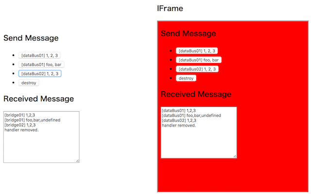

# post-message-data-bus
- postMessageを用いてクロスドメイン通信をするDataBusのTypeScript用の実装を提供します
- Node.jsで利用することを想定しています

## Example
[sampleディレクトリ](sample)以下に, 親コンテンツと子コンテンツ（IFrame）を `PostMessageDataBus` で接続して, メッセージを送受信する簡単なサンプルコンテンツがあります。
- 親コンテンツの実装: [sample/index.html](sample/index.html), [sample/src/parent.ts](sample/src/parent.ts)
- 子コンテンツの実装: [sample/child.html](sample/child.html), [sample/src/child.ts](sample/src/child.ts)

`gulp compile:sample` でビルド後, [sample/index.html](sample/index.html) をブラウザで開けば動作を確認できます。



- `dataBus01` : データを送信する（何回でも送信できる）
- `dataBus02` : データを送信後, 受信ハンドラを解除（1回しか送信できない）

## Setup
### package.json
```
    "dependencies": {
        "@cross-border-bridge/post-message-data-bus": "~2.0.0"
    },
```

## Usage
#### step 1: import
```typescript
import * as db from "@cross-border-bridge/post-message-data-bus";
```

#### step 2: PostMessageDataBusの準備
通信先の `window` を指定して `PostMessageDataBus` のインスタンスを生成します。

##### （親コンテンツ→IFrame方向の実装例）
```typescript
    const child = <HTMLIFrameElement>document.getElementById("child");
    const dataBus = new db.PostMessageDataBus(child.contentWindow);
```

##### （IFrame→親コンテンツ方向の実装例）
```typescript
	const dataBus = new db.PostMessageDataBus(window.parent);
```

#### step 3: 受信データの受け口を設定
ハンドラを指定して `DataBus#addHandler` を実行することで, リモート側が送信したデータを受信できます。

```typescript
    dataBus.addHandler((data) => {
        データ受信時の処理
    });
```

> ハンドラの解除手段には, 以下2種類の方法があります
> - `データ受信時の処理` で `return true` をする
> - `DataBus#removeHandler` を実行する

#### step 4: データを送信
`DataBus#send` を実行することで, リモート側へデータを送信できます。

```typescript
    dataBus.send(data);
```

#### step 5: 破棄
`DataBus#destroy` で破棄できます。

```typescript
    dataBus.destroy();
```

## License
本リポジトリは MIT License の元で公開されています。
詳しくは [LICENSE](LICENSE) をご覧ください。
